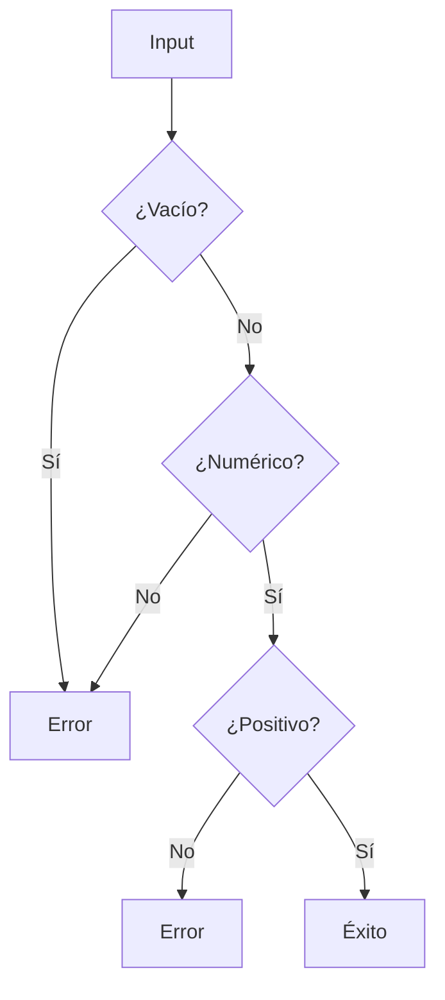

# 🐍 Python Coding Challenges - MoureDev Solutions

```txt
/*
 * Crea una única función (importante que sólo sea una) que sea capaz
 * de calcular y retornar el área de un polígono.
 * - La función recibirá por parámetro sólo UN polígono a la vez.
 * - Los polígonos soportados serán Triángulo, Cuadrado y Rectángulo.
 * - Imprime el cálculo del área de un polígono de cada tipo.
 */
```

### Estructura de Reporte para Calculadora de areas Geometricas

#### **Título del Proyecto**  
`Calculadora de Áreas Geométricas - Reto MoureDev`

#### **1. Descripcion del Reto**
```markdown
Programa que calcula áreas de figuras geométricas básicas:
- Triángulo: (base × altura) / 2
- Cuadrado: lado²
- Rectángulo: base × altura
```

#### **2. Características Implementadas**
```markdown
✅ Menú interactivo con 5 opciones  
✅ Validación robusta de entradas numéricas  
✅ Manejo de señales (Ctrl+C) para salida elegante  
✅ Salidas con colores para mejor legibilidad  
✅ Limpieza de pantalla incorporada  
✅ Cálculos precisos con 2 decimales  
```

#### **3. Arquitectura del Código**
```markdown
### Componentes principales:
- **Clase `FigurasGeometricas`**:
  - Métodos para cálculo de áreas (triángulo, cuadrado, rectángulo)
  - Retorno de resultados formateados con color

- **Funciones clave**:
  - `validar_dato()`: Filtra entradas no numéricas/vacías/negativas
  - `clean_screen()`: Limpia terminal (compatible Windows/Linux)
  - `finish_program()`: Salida controlada con mensaje
  - `ctrl_c()`: Manejo de interrupciones con Ctrl+C

- **Flujo principal (`main()`)**:
  1. Menú interactivo con opciones
  2. Captura y validación de parámetros
  3. Cálculo y despliegue de resultados
  4. Gestión de limpieza/salida
```

#### **4. Validación de Entradas**


#### **5. Instrucciones de Uso**
```bash
# Requisito:
pip install termcolor

# Ejecución:
python figuras_geometricas.py

# Opciones del menú:
1 → Triángulo (base y altura)
2 → Cuadrado (lado)
3 → Rectángulo (base y altura)
4 → Limpiar pantalla
5 → Salir
```

---