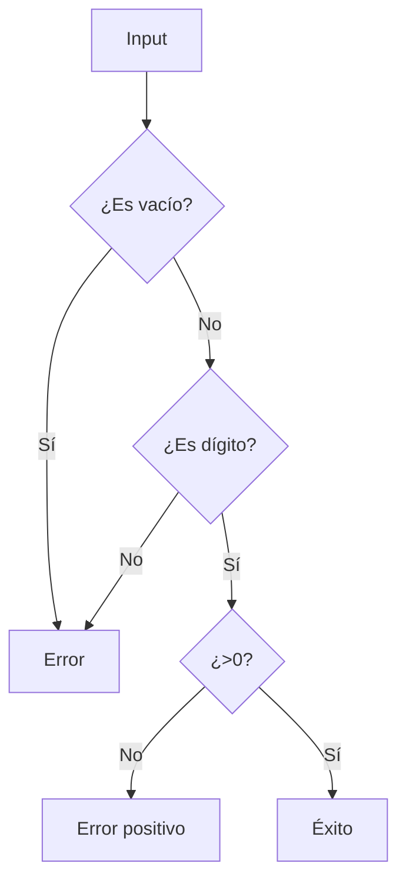

# 🐍 Python Coding Challenges - MoureDev Solutions

```txt
/*
 * Escribe un programa que muestre por consola (con un print) los
 * números de 1 a 100 (ambos incluidos y con un salto de línea entre
 * cada impresión), sustituyendo los siguientes:
 * - Múltiplos de 3 por la palabra "fizz".
 * - Múltiplos de 5 por la palabra "buzz".
 * - Múltiplos de 3 y de 5 a la vez por la palabra "fizzbuzz".
 */
```
### **Título del Proyecto**
`Solución al Reto FizzBuzz de MoureDev en Python`

#### **1. Descripción del Reto**
Breve explicación del objetivo:
```
Programa que muestra números en un rango determinado:
- Múltiplos de 3 → "FIZZ"
- Múltiplos de 5 → "BUZZ"
- Múltiplos de 3 y 5 → "FIZZBUZZ"
```

#### **2. Características Implementadas**
Lista de funcionalidades clave:
```
✔️ Sistema interactivo con menú de opciones
✔️ Validación robusta de entradas numéricas
✔️ Manejo de errores y señales (Ctrl+C)
✔️ Salida con colores para mejor legibilidad
✔️ Limpieza automática de pantalla
```

#### **3. Estructura del Código**
Explicación concisa de la arquitectura:

##### Componentes principales:
- **Clase `FizzBuzz`**:
  - Constructor: Inicializa rango numérico
  - Método `fizz_buzz()`: Lógica principal de reemplazo

- **Funciones auxiliares**:
  - `validar_dato()`: Filtra entradas inválidas
  - `clean_screen()`: Limpia la terminal
  - `finish_program()`: Salida controlada

- **Manejo de señales**:
  - Intercepción de Ctrl+C con mensaje personalizado

- **Flujo principal (`main()`)**:
  - Menú interactivo (iniciar/limpiar/salir)
  - Llamada a la lógica FizzBuzz
  
#### **4. Validación de Entradas**
Cómo se asegura la calidad de los datos:
```markdown
- Comprueba vacíos y espacios
- Rechaza caracteres no numéricos
- Verifica números positivos
- Mensajes de error intuitivos con color
```

#### **5. Ejecución del Programa**
Instrucciones básicas:
```bash
# Requisitos:
pip install termcolor

# Ejecutar:
python fizzbuzz.py

# Opciones del menú:
1 → Ingresar rango numérico
2 → Limpiar pantalla
3 → Salir
```

---

## 🚦 Validaciones
Garantizamos que:


