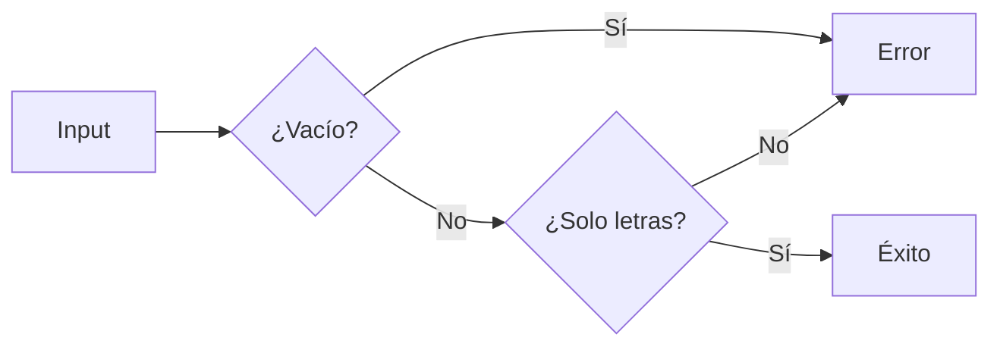

# 🐍 Python Coding Challenges - MoureDev Solutions
### Estructura de Reporte para Inversor de Cadenas

#### **Titulo del Proyecto**  
`Inversor de Cadenas - Reto MoureDev`

#### **1. Descripcion del Reto**
```markdown
Programa que invierte cadenas de texto con:
- Validación estricta de entradas (solo caracteres alfabéticos)
- Interfaz interactiva con menú de opciones
- Salida coloreada para mejor visualización
```

#### **2. Caracteristicas Implementadas**
```markdown
✅ Menú interactivo con 3 opciones  
✅ Validación de entradas alfabéticas (rechaza números y vacíos)  
✅ Manejo de señales (Ctrl+C) para salida controlada  
✅ Propiedad de clase para inversión mediante slicing  
✅ Limpieza de pantalla multiplataforma  
✅ Formato de salida con colores (termcolor)  
```

#### **3. Arquitectura del Codigo**
```markdown
### Componentes principales:
- **Clase `InvierteCadenas`**:
  - Constructor: Almacena cadena original
  - Propiedad `invertir_cadena`: Devuelve cadena invertida con formato

- **Funciones clave**:
  - `validar_dato()`: Filtra entradas no alfabéticas/vacías
  - `limpiar_pantalla()`: Limpia terminal (Windows/Linux)
  - `terminar_programa()`: Salida controlada con mensaje
  - `ctr_c()`: Manejo de Ctrl+C

- **Flujo principal (`main()`)**:
  1. Menú cíclico con opciones
  2. Validación estricta de input
  3. Inversión mediante slicing [::-1]
  4. Gestión de limpieza/salida
```

#### **4. Validación de Entradas**


#### 🚀 **5. Instrucciones de Uso**
1. Ejecutar: `python inversor_cadenas.py`
2. Seleccionar opción 1
3. Ingresar cadena alfabética (ej: "HolaMundo")
4. Ver resultado invertido (ej: "odnuMaloH")

Ejemplo de salida:
```bash
[+] La cadena invertida es: ( odnuMaloH )
```


#### **6. Limitaciones y Mejoras Futuras**
```markdown
🔸 Limitación actual:  
   - No acepta espacios ni caracteres especiales
   
🔹 Mejoras propuestas:  
   - Añadir soporte para frases completas (espacios)
   - Implementar inversión conservando mayúsculas
```

#### **7. Aprendizajes Clave**
```markdown
- ✨ Uso de propiedades (@property) en clases
- 🛡️ Técnicas de validación para cadenas alfabéticas
- 🔠 Manipulación de strings con slicing [::-1]
- 🎨 Mejora de UX con colores y mensajes contextuales
- ⚙️ Manejo de señales del sistema (SIGINT)
- 🔄 Estructura de menú cíclico eficiente
```

---