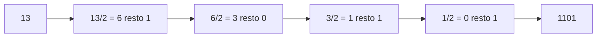
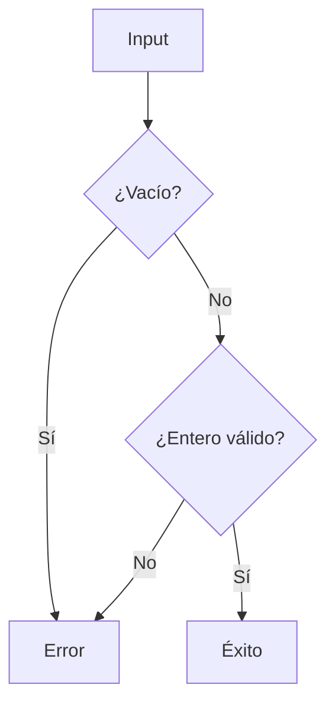

# 🐍 Python Coding Challenges - MoureDev Solutions
### Estructura de Reporte para Conversor Decimal-Binario

#### **Título del Proyecto**  
`Conversor Decimal a Binario - Reto MoureDev`

#### **1. Descripcion del Reto**
```markdown
Programa que convierte números decimales a su representación binaria:
- Maneja números enteros positivos y negativos
- Implementa algoritmo de conversión manual (sin funciones built-in)
- Interfaz interactiva con validación de entradas
```

#### **2. Caracteristicas Implementadas**
```markdown
✅ Menú interactivo con 3 opciones  
✅ Validación robusta de enteros (positivos/negativos)  
✅ Manejo de señales (Ctrl+C) para salida controlada  
✅ Algoritmo de conversión manual mediante división sucesiva  
✅ Soporte multiplataforma (Windows/Linux)  
✅ Salida coloreada para mejor visualización  
```

#### **3. Arquitectura del Codigo**
```markdown
### Componentes principales:
- **Clase `ConversionarDecimalBinario`**:
  - Método `convertir_a_binario()`: Implementa el algoritmo de conversión
  - Manejo especial para cero y números negativos

- **Funciones clave**:
  - `validar_numero()`: Valida enteros con signo
  - `limpiarPantalla()`: Limpia terminal
  - `terminar_programa()`: Salida elegante
  - `ctrl_c()`: Manejo de Ctrl+C

- **Flujo principal (`main()`)**:
  1. Menú interactivo
  2. Captura y validación de entrada
  3. Conversión a binario
  4. Presentación de resultados
```

#### **4. Algoritmo de Conversion**
Explicación del núcleo lógico:
```python
def convertir_a_binario(self, numero_decimal):
    if numero_decimal == 0:
        return "0"  # Caso especial para cero
    
    binario = ""
    num = abs(numero_decimal)  # Trabajamos con valor absoluto
    
    while num > 0:
        binario = str(num % 2) + binario  # Obtenemos del residuo
        num = num // 2  # División entera
        
    # Manejo de signo
    return binario if numero_decimal > 0 else "-" + binario
```

## 🧩 Diagrama de Conversion


Ejemplo:
```bash
[+] El numero en binario es: -1101
```
#### **5. Validacion de Entradas**


#### 🚀 **6. Instrucciones de Uso**
```bash
# Requisito:
pip install termcolor

# Ejecución:
python decimal_binario.py

# Opciones del menú:
1 → Convertir número
2 → Limpiar pantalla
3 → Salir

# Ejemplo de conversión:
Entrada: -13
Salida: -1101
```

#### **7. Limitaciones y Mejoras Futuras**
```markdown
🔸 Limitación actual:  
   - Solo maneja enteros (no flotantes)
   
🔹 Mejoras propuestas:  
   - Añadir soporte para números fraccionarios
   - Implementar conversión hexadecimal/octal
```

#### **8. Aprendizajes Clave**
```markdown
- ✨ Implementación manual de algoritmos matemáticos
- 🔢 Manejo de conversión de bases numéricas
- ➗ Técnica de división sucesiva para conversión binaria
- ➖ Tratamiento especial para números negativos
- 🛡️ Validación de enteros con signo
- 🎨 Mejora de UX con colores y mensajes claros
```

---