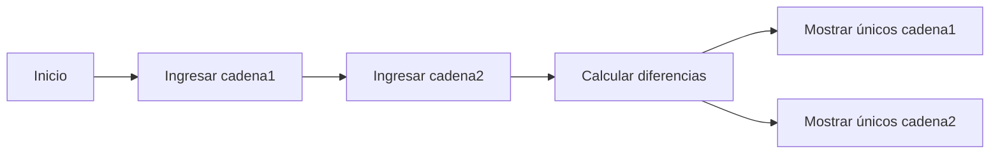
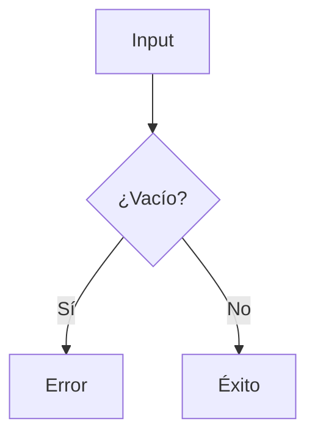

# 🐍 Python Coding Challenges - MoureDev Solutions
### Estructura para Comparador de Cadenas

#### **Titulo del Proyecto**  
`Comparador de Caracteres Únicos - Reto MoureDev`

#### **1. Descripcion del Reto**
```markdown
Programa que compara dos cadenas de texto identificando:
- Caracteres únicos en la primera cadena (no presentes en la segunda)
- Caracteres únicos en la segunda cadena (no presentes en la primera)
```

#### **2. Caracteristicas Implementadas**
```markdown
✅ Interfaz interactiva con menú  
✅ Validación de entradas no vacías  
✅ Manejo de señales (Ctrl+C) para salida controlada  
✅ Detección de caracteres únicos mediante list comprehensions  
✅ Salida formateada con colores  
✅ Limpieza de pantalla multiplataforma  
✅ Mensaje de bienvenida explicativo  
```

#### **3. Arquitectura del Codigo**
```markdown
### Componentes principales:
- **Clase `EliminarCaracteres`**:
  - Constructor: Almacena ambas cadenas
  - `calcular_diferencias()`: Detecta caracteres únicos en cada cadena
  - Propiedades: `resultado_cadena_uno` y `resultado_cadena_dos` para mostrar resultados formateados

- **Funciones clave**:
  - `validar_dato()`: Garantiza entradas no vacías
  - `limpiar_pantalla()`: Limpia la terminal
  - `terminar_programa()`: Salida controlada
  - `ctrl_c()`: Manejo de Ctrl+C
  - `mostrar_bienvenida()`: Explica el programa

- **Flujo principal (`main()`)**:
  1. Muestra mensaje de bienvenida
  2. Menú interactivo
  3. Captura y validación de dos cadenas
  4. Cálculo y presentación de diferencias
```

#### **4. Algoritmo de Comparacion**
Explicación del núcleo lógico:
```python
def calcular_diferencias(self):
    # Caracteres en cadena1 que no están en cadena2
    unicos1 = [c for c in self.string_uno if c not in self.string_dos]
    
    # Caracteres en cadena2 que no están en cadena1
    unicos2 = [c for c in self.string_dos if c not in self.string_uno]
    
    return unicos1, unicos2
```

## 🧩 Diagrama de Flujo


#### **5. Validación de Entradas**


#### **6. Instrucciones de Uso**
```bash
# Ejecución:
python comparador_cadenas.py

# Opciones del menú:
1 → Iniciar comparación
2 → Limpiar pantalla

# Ejemplo:
Cadena 1: "hola"
Cadena 2: "adios"

Salida:
Caracteres solo en cadena1: h, l
Caracteres solo en cadena2: d, i, s
```

#### **7. Limitaciones y Mejoras Futuras**
```markdown
🔸 Limitación actual:  
   - Distingue entre mayúsculas y minúsculas
   - Considera espacios como caracteres válidos
   
🔹 Mejoras propuestas:  
   - Añadir opción para ignorar mayúsculas/minúsculas
   - Mostrar conteo de caracteres únicos
   - Implementar comparación de palabras completas
```

#### **8. Aprendizajes Clave**
```markdown
- ✨ Uso de list comprehensions para filtrado eficiente
- 📊 Comparación de conjuntos de caracteres
- 🧩 Diseño de clases con propiedades calculadas
- 🛡️ Validación básica de entradas
- 🎨 Presentación de resultados con formato
- ⚙️ Manejo de interrupciones con Ctrl+C
```

---